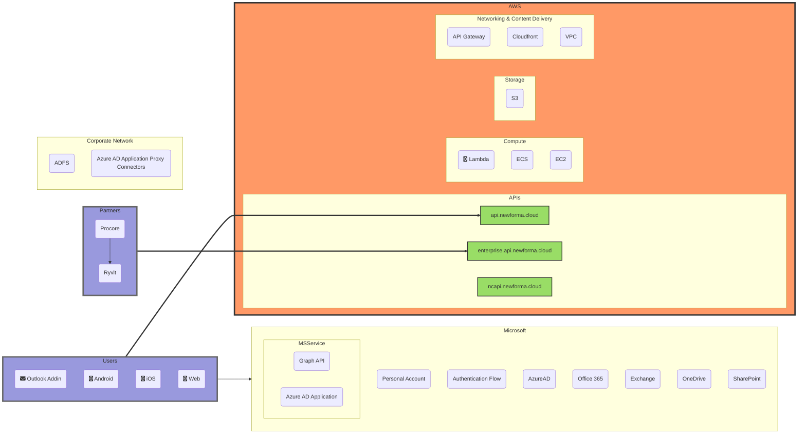

```mermaid

graph LR
    subgraph Users
        Outlook(fa:fa-envelope Outlook Addin)
        Android(fa:fa-android Android)
        iOS(fa:fa-apple iOS)
        Web(fa:fa-chrome Web)
    end
    
    subgraph Partners
        Procore(Procore) --> Ryvit(Ryvit)
    end
    
    subgraph Microsoft
        Personal(Personal Account)
        AuthFlow(Authentication Flow)
        AzureAD(AzureAD)
        subgraph MSService
            GraphAPI(Graph API)
            AzureADApp(Azure AD Application)
        end
        Office365(Office 365)
        Exchange(Exchange)
        OneDrive(OneDrive)
        SharePoint(SharePoint)
    end

    subgraph AWS
        subgraph APIs
            api[api.newforma.cloud]
            eapi[enterprise.api.newforma.cloud]
            ncapi[ncapi.newforma.cloud]
        end
        subgraph Compute
            Lambda(fa:fa-amazon Lambda)
            ECS(ECS)
            EC2(EC2)
        end
        subgraph Storage
            S3(S3)
        end
        subgraph Networking & Content Delivery
            API_Gateway(API Gateway)
            Cloudfront(Cloudfront)
            VPC(VPC)
        end
    end
    subgraph Corporate Network
        ADFS(ADFS)
        AzureProxy(Azure AD Application Proxy Connectors)
    end

    Users-->Microsoft

    Partners==>eapi
    Users==>api

    classDef green fill:#9d6,stroke:#333,stroke-width:2px
    classDef orange fill:#f96,stroke:#333,stroke-width:4px
    classDef blue fill:#99d,stroke:#666,stroke-width:4px

    class Users,Partners blue
    class api,eapi,ncapi green
    class AWS orange

```
